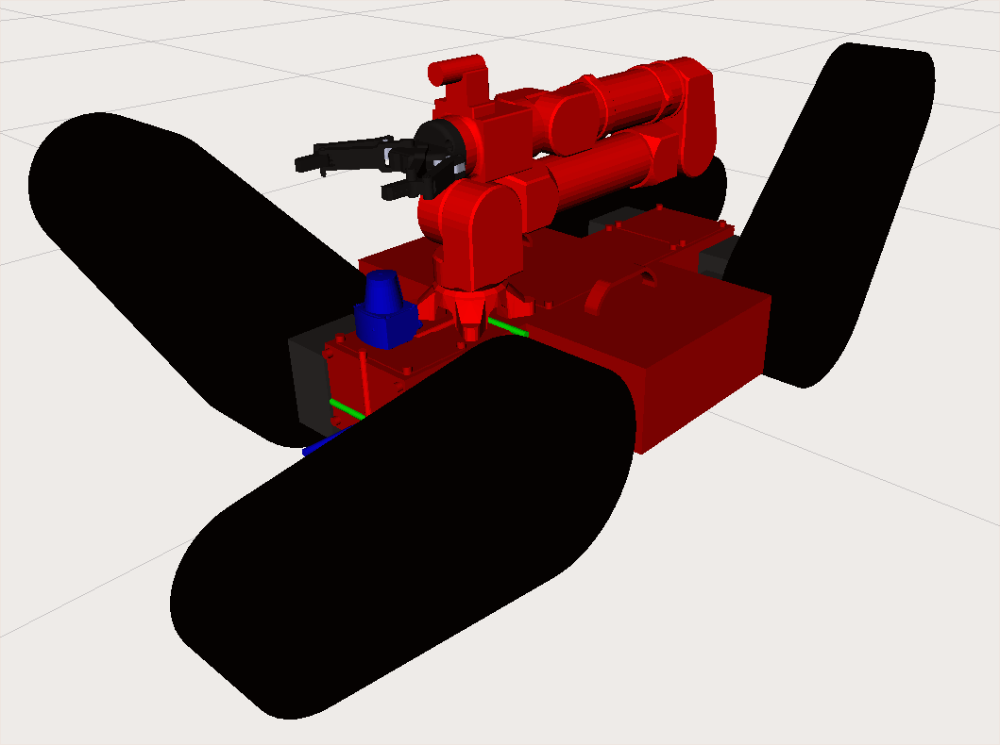

# markhor_description
This package is a support package for the markhor robot.





## Dependecies
This package requires clubcapra/ovis_description

## To test with RViz

### Test standalone robot
```
roslaunch markhor_description display_markhor.launch
```

### Testing robot with sensors and the ovis robotic arm
```
roslaunch markhor_description display_markhor_w_attachments.launch
```